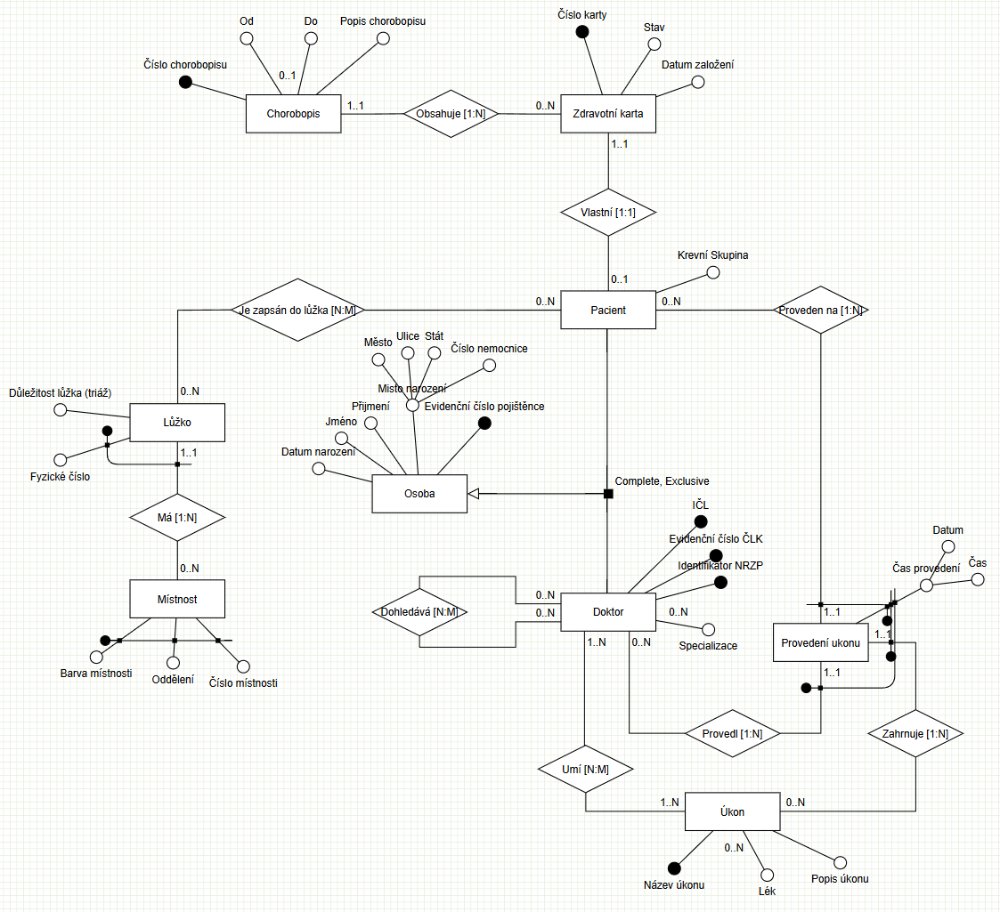
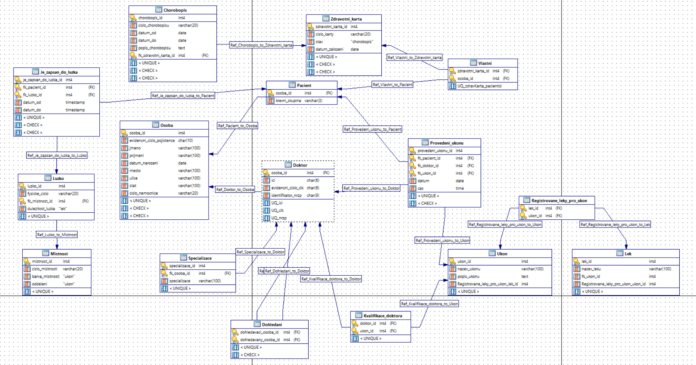

# Hospital Information System (HIS) - Conceptual Data Model

## Project Overview
The goal of this project is to design a comprehensive database system for a hospital facility. The core of the system focuses on the precise tracking of medical procedures and medication administration, recorded at specific timestamps for hospitalized patients.

---

## Entity Descriptions

### 1. Bed (Weak Entity)
* **Triage Importance:** This attribute defines the urgency category and the level of equipment provided by the bed. It follows the triage process, classifying beds based on the specific type of care they are equipped to support.
* **Existence Dependency:** A Bed is a weak entity; it cannot exist in the system without being assigned to a specific **Room**.

### 2. Room
* **Composite Primary Key:** A unique identifier composed of three attributes: **Room Color**, **Department**, and **Room Number**.
* **Room Color Coding:** Rooms are categorized by color to indicate the patient demographic or severity:
    * **Green:** Pediatric (Children's) ward.
    * **White:** Adult ward.
    * **Light Blue:** Critical Care / Seriously ill patients.

### 3. Person
* **Place of Birth (Structured Attribute):** This complex attribute is composed of:
    * City, State, Street, and **Birth Hospital ID**.
* **Legal Significance:** The Birth Hospital ID is a critical identifier for legal and informational tracking of original birth records.

### 4. Doctor
* **Reflexive Relationship (Supervision):** The system tracks a hierarchy of oversight:
    * A doctor can manage $0$ to $n$ subordinates.
    * A doctor can be overseen by $0$ to $n$ supervisors (allowing for multidisciplinary supervision).

### 5. Procedure Execution (Weak Entity)
This entity represents the specific instance of a medical task being performed.
* **Doctor Link:** Every execution must be performed by exactly one doctor.
* **Patient Link:** Every execution is performed on exactly one patient.
* **Procedure Type:** Each execution maps to a specific predefined procedure.

### 6. Medications (Multivalued Attribute)
* **Concurrent Administration:** Certain procedures involve giving multiple medications to a patient simultaneously. 
* **Safety Constraint:** Tracking these as a set is vital to monitor for drug-to-drug interactions (contraindications).

---

## Business Rules & Constraints

### Exclusive Inheritance (Specialization)
The system implements a strict **Exclusive ISA** relationship between `Person`, `Patient`, and `Doctor`:
* **The Conflict Rule:** According to hospital policy, a doctor employed by the facility **cannot** be registered as a patient within the same facility. This prevents professional boundary issues and personal relationship complications among staff.
* A person record must be either a Doctor or a Patient, but never both.

---

## Entity Relationship Overview

| Entity | Type | Parent/Dependency |
| :--- | :--- | :--- |
| **Room** | Strong | None (Composite ID) |
| **Bed** | Weak | Room |
| **Doctor** | Strong | Reflexive (Supervision) |
| **Procedure Execution** | Weak | Doctor, Patient, Procedure |
| **Patient** | Strong | Person (Exclusive Inheritance) |

---
__google docs - https://docs.google.com/document/d/1bF9JZ6MqEfWm0WBoxvJKEmGW2fETQFNYmoHtITmOv0Q/edit?usp=sharing__

https://docs.google.com/document/d/1-ORNHRvT3AhHjB5mCkCpj6KXpXX5u2Z1HJhAA63lsLs/edit?tab=t.0

**Conceptual Model Diagram:** 
**Physical model:** 
